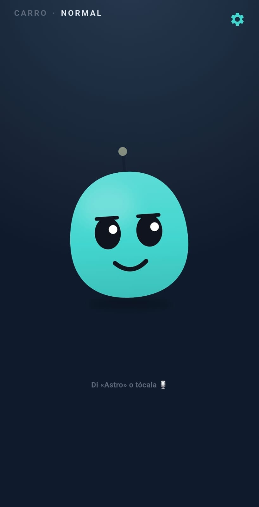
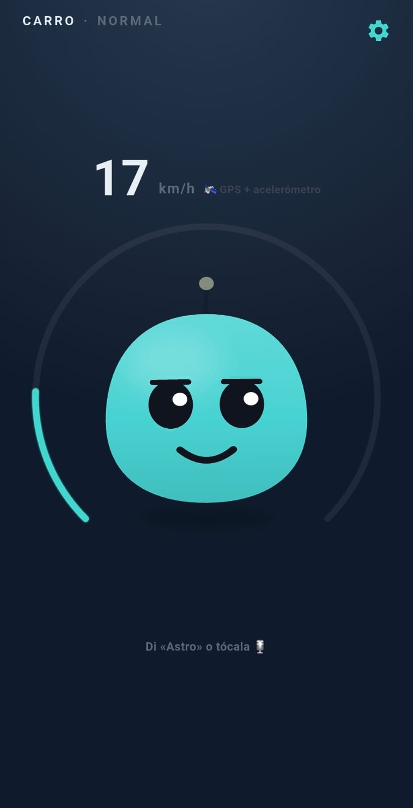
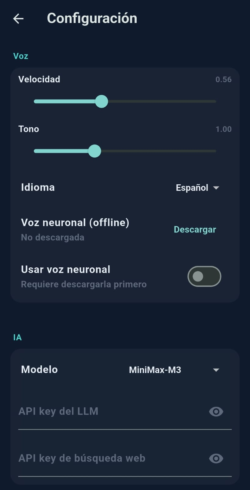
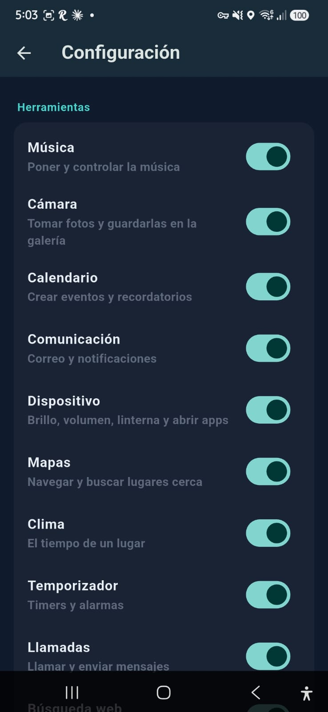
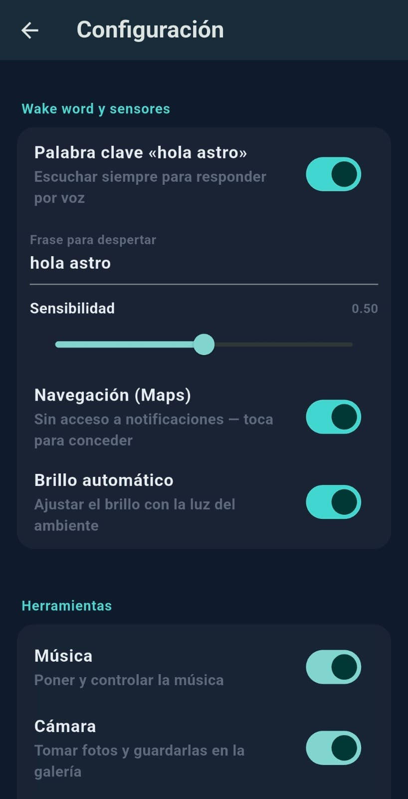
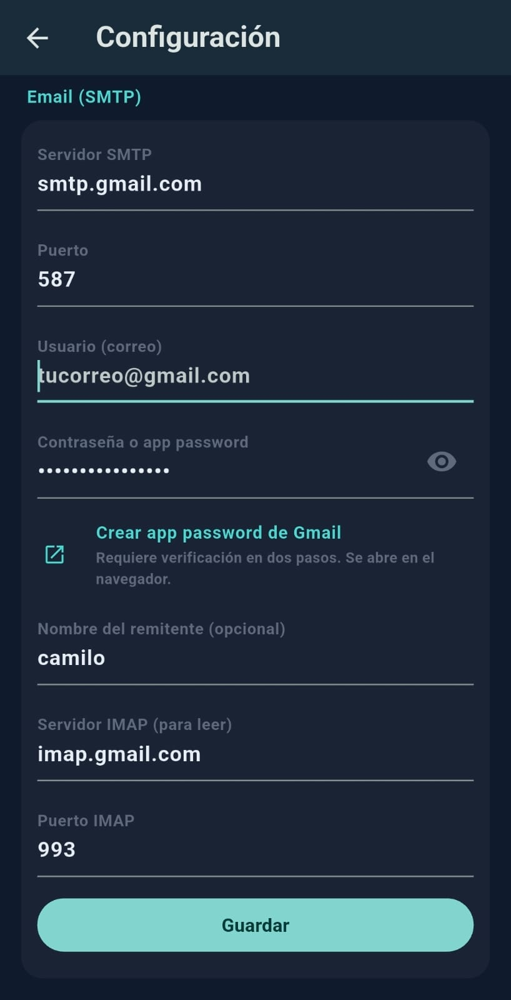

<p align="center">
  
</p>

<h1 align="center">Astro</h1>

<p align="center">
  <b>An AI pet that lives on your car dashboard.</b><br/>
  It senses the drive, reacts with mood and voice, and gets things done for you
  — hands-free.
</p>

<p align="center">
  <a href="https://github.com/lordmacu/astro-agent/releases/latest/download/astro.apk"></a>
  <a href="https://github.com/lordmacu/astro-agent/actions/workflows/build-apk.yml"></a>
</p>

<p align="center">
  
</p>

---

## Meet Astro

Mount a phone on your dashboard and Astro comes to life. It feels the drive —
how fast you go, a hard brake, the light outside, a turn coming up on the map —
and reacts with a **mood, an animation, and a spoken line**.

Say **"hola Astro"** (or tap it) and it becomes a hands-free copilot: it listens,
understands, decides what to do, and answers out loud — playing music, setting a
timer, sending a message, navigating, taking a photo, and more.

No car adapter. No root. The essentials just work on the phone alone.

## Why it's fun

- 🗣️ **Talk to it, hands-free.** Offline wake word → it listens → it answers out
  loud, holding a real back-and-forth.
- 🎭 **It has moods.** Excited on a spirited pull, spooked by a hard brake,
  worried when the engine runs hot, happy on arrival, sleepy when parked — it
  leans and looks toward your next turn.
- 🧠 **It actually does things.** Not just chat — it calls real tools to act on
  the car and phone (see below).
- 🚗 **Dashboard-aware.** Car mode shows speed and reacts to driving; normal mode
  is a calm desk companion.
- 🔊 **Two voices.** A snappy built-in voice, plus an optional **neural voice you
  download on demand** for offline, natural speech.
- 🔒 **Yours.** Runs on-device; it even remembers things about you in a local
  database, and asks before doing anything that reaches the outside world.
- 🆓 **Free out of the box.** Ships with a **free, keyless LLM** for the brain and
  **keyless web search** (DuckDuckGo) — no API key, no card. Add your own key
  later for a paid model or a better search backend if you want.

## What Astro can do

Astro's brain calls small, focused tools. Ask in plain language and it picks the
right one:

- 🕑 **Know the moment** — time, current speed, and where you are.
- 🎵 **Play music** — search and control playback on whatever music app you use.
- 🔦 **Control the phone** — screen brightness, volume, flashlight.
- 🗺️ **Navigate** — open Google Maps to a destination; Astro even reads the
  turn-by-turn guidance and leans into the next turn.
- ⏰ **Timers & alarms.**
- 📞 **Call or message** — by contact name (WhatsApp / SMS).
- ✉️ **Email** — send it (or open a ready-to-send draft), and check your inbox.
- 📅 **Calendar** — create events and reminders.
- 🌐 **Search the web** — pull fresh facts when it needs them, **keyless by
  default** (DuckDuckGo); use Tavily/Brave or a self-hosted SearXNG if you add one.
- 🌦️ **Weather & places.**
- 📸 **Take a photo** — front or back camera, with a shutter sound and a preview
  popup.
- 🧠 **Remember you** — it stores facts about you and recalls them later, on its
  own.

> Read-only actions run instantly; anything outward-facing (send a message, send
> an email) asks for a quick **voice confirmation** first.

## Screenshots

<table>
  <tr>
    <td align="center">
      <br/>
      <sub><b>Car mode</b> — speed (GPS + IMU) and the velocity ring</sub>
    </td>
    <td align="center">
      <br/>
      <sub><b>Settings</b> — voice + AI model picker &amp; neural-voice download</sub>
    </td>
    <td align="center">
      <br/>
      <sub><b>Tools</b> — enable/disable each agent capability</sub>
    </td>
  </tr>
  <tr>
    <td align="center">
      <br/>
      <sub><b>Wake word &amp; sensors</b> — phrase, sensitivity, nav, brightness</sub>
    </td>
    <td align="center">
      <br/>
      <sub><b>Email</b> — optional SMTP/IMAP (falls back to the mail app)</sub>
    </td>
    <td align="center">
      <br/>
      <sub><b>Astro</b></sub>
    </td>
  </tr>
</table>

<br/>

---

# Under the hood

The rest of this README is for developers.

## Architecture

One pattern runs through the whole app:

```
sensor  ->  filter/threshold  ->  state  ->  mood (priority cascade)  ->  animation + line + voice
```

1. **Sensors** each expose their own `Stream` (motion, GPS speed, light,
   proximity, and — in car mode — navigation) and never touch the UI directly.
2. Streams merge (rxdart `CombineLatest`) into one immutable **`AppState`**.
3. A pure **`MoodResolver`** collapses `AppState` into a single `Mood` through a
   priority cascade; a navigation posture (gaze / lean / "turn imminent") is
   layered on top, not competing with the mood.
4. The character renders the mood; the bilingual (EN/ES) speech catalog provides
   the line.
5. On the wake word, the **agentic loop** runs: the LLM sees the conversation
   plus relevant memories, calls tools, feeds results back, and streams the
   answer sentence-by-sentence so Astro starts talking early.

## The agentic brain

- A cloud LLM drives a custom tool-use loop: `user → model → (tool? → run
  locally → result →) model → … → final spoken answer`. It ships with a **free,
  keyless model** by default; point it at MiniMax or any OpenAI-compatible
  endpoint with your own key from Settings.
- Tools implement a small contract (name, description, JSON schema, `run`) and
  register in a central registry.
- Outward-facing tools require confirmation; the gate is per-call, so e.g. email
  only asks when it will actually send over SMTP (not when it just opens a
  draft).
- Latency-tuned: reasoning disabled, priority service tier, streamed sentences,
  a capped answer length, and trimmed history / memory recall.

## Voice

- **Wake word** — offline, always-on, hosted in an Android foreground service.
- **Speech-to-text** — captures the command.
- **Text-to-speech** — `flutter_tts` (system) by default; an optional
  **sherpa-onnx / Piper neural voice** can be downloaded from Settings for
  offline, natural speech. Mouth visemes animate while it speaks.

## In-app settings (⚙️)

- **AI** — model picker (a **free keyless model** by default, plus MiniMax /
  OpenAI-compatible presets) + optional API keys, and a **search provider**
  picker (Tavily or Brave) with a link to get its key. All override `.env` at
  runtime (precedence: in-app > `.env` > build define).
- **Voice** — rate, pitch, language (EN/ES), download/enable the neural voice.
- **Wake word & sensors** — wake word on/off + sensitivity, Maps nav listener,
  auto brightness.
- **Memory** — view the remembered-item count and clear it.
- **Permissions** — request microphone, notifications, location.
- **About** — version and diagnostics.

## Tech stack

| Layer | Choice |
|---|---|
| State / DI | Riverpod 2 |
| Stream combination | rxdart |
| Immutable models | freezed + json_serializable |
| Character | Rive state machine (planned); placeholder renderer today |
| Sensors | `sensors_plus`, `geolocator` (GPS + IMU speed fusion), `light`, native proximity |
| Navigation | native `NotificationListenerService` reading Google Maps |
| Voice | offline wake word + STT; `flutter_tts` (system) + sherpa-onnx / Piper (neural, optional) |
| Brain | HTTP to a cloud LLM (free keyless model by default; MiniMax / OpenAI-compatible optional) + custom tool loop |
| Web search | keyless DuckDuckGo by default; Tavily / Brave (key) or self-hosted SearXNG (keyless) |
| Memory | SQLite (`sqflite`) with full-text (and semantic) recall |
| Platform | Android, no root; foreground service + method/event channels |

> **Language rule:** all code is English. Astro's *voice* is bilingual (EN + ES)
> and lives in a speech catalog, never as loose strings in logic.

## Getting started

```bash
flutter pub get

# Astro works out of the box with a free, keyless model + keyless search — no
# .env needed. Optionally add a key for a paid model or a better search backend
# (also settable in-app from Settings):
echo 'LLM_API_KEY=your_key_here' > .env   # optional: TAVILY_API_KEY, ASTRO_MODEL, TTS_MODEL_URL

flutter run          # on a connected Android device (fast: one ABI + hot reload)
flutter analyze      # no warnings before you finish
flutter test         # unit + widget tests

dart run build_runner build --delete-conflicting-outputs   # freezed / json
dart run flutter_launcher_icons                            # regenerate the launcher icon
flutter build apk --release
```

## Project layout

```
lib/
  core/state/   AppState, Mood, MoodResolver (the cascade), combined provider
  core/config/  thresholds, design tokens, settings store
  sensors/      motion, location (speed fusion), light, proximity, navigation
  voice/        wake word, STT, TTS (system + neural), visemes
  brain/        agentic loop + tools (context, music, device, navigate, phone,
                communication, calendar, camera, web search, memory, …)
  ui/           pet screen, HUD, settings, photo viewer
  platform/     Android channels: media, proximity, camera, system actions
android/        manifest, permissions, Kotlin services (wake word, nav listener)
```

## Status

Active development. The sensor pipeline, mood cascade, voice loop, agentic brain,
in-app settings, downloadable neural voice, Maps navigation listener, and the
tool set above are in place. OBD (car diagnostics over BLE) is planned and
intentionally optional — the basics never depend on it.
